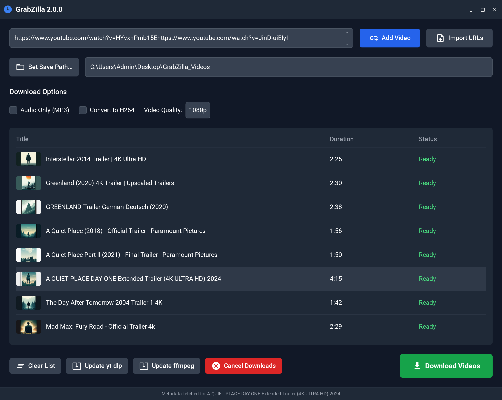

# GrabZilla 2.0

A professional video downloading and transcoding application built with Tauri (Rust + React).



## 🚀 Features

- **Smart URL Extraction**: Automatically extract URLs from text, HTML, RTF
- **Batch Processing**: Download multiple videos, playlists, and channels
- **Professional Transcoding**: H.264, DNxHR SQ, ProRes Proxy, MP3 formats
- **Advanced Queue Management**: Virtual scrolling, drag-and-drop reordering
- **Enterprise Security**: Process sandboxing, network whitelisting

## 📋 Prerequisites

- **Node.js** (v16+)
- **Rust** (1.77.2+)
- **yt-dlp** (latest version)
- **FFmpeg** (latest version)

## 🔧 Setup

1. **Clone the repository**

```bash
git clone https://github.com/yourusername/GrabZilla20.git
cd GrabZilla20
```

2. **Install dependencies**

```bash
npm install
```

3. **Install system dependencies**

```bash
# macOS/Linux
./scripts/setup-dependencies.sh

# Windows
.\scripts\setup-dependencies.ps1
```

4. **Run the application**

```bash
npm run tauri dev
```

## 🧪 Testing Status

The application has made significant progress:

- **✅ Phase 1 (Foundation)**: UI components, theming, and basic layout are fully functional
- **✅ Phase 2 (Smart URL Extraction)**: URL extraction, cleaning, and modal dialog are working
- **⚠️ Phase 3-5 (Advanced Features)**: Most modules have been fixed and enabled, but not fully tested

### Fixed Modules
- ✅ URL Parser
- ✅ Progress Tracker
- ✅ Retry Manager
- ✅ Security Manager
- ✅ Secure Process
- ✅ FFmpeg Controller
- ✅ Download Manager
- ❌ Update Manager (missing dependency)
- ❌ Commands (conflicts with simplified version)

### Testing Resources

- **Test Plan**: See `scripts/simplified-test-plan.md` for a detailed test plan
- **Test URLs**: Use `test-urls.txt` for testing URL extraction
- **Test Report**: See `scripts/test-report.md` for current testing results

## 🛠️ Development Roadmap

1. **Complete Module Fixes**: Add missing dependency `tauri-plugin-updater` and resolve command conflicts
2. **Test Advanced Features**: Test actual downloads, conversions, error handling, and security features
3. **Update Documentation**: Create comprehensive user guide and update documentation

## 📝 License

[MIT](LICENSE) 